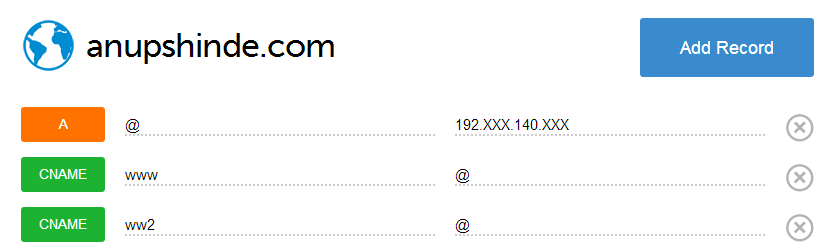

I recently moved my domain from AppEngine to DigitalOcean.  You can read about it here <a href="/posts/going-static" target="_blank">Going Static</a>

DigitalOcean's guide [How To Set Up a Host Name with DigitalOcean](https://www.digitalocean.com/community/articles/how-to-set-up-a-host-name-with-digitalocean) to move your domain mentions that you need to change your Name Servers to that of DigitalOcean. However if you do not wish to migrate a lot of records and do not wish to change your name servers, read on.

---

## Change A-Records

In case you do not wish to change your Name Servers, you can also point your domain's A records to your DigitalOcean server IP. Similarly you also need to point your sub-domains to you DO IP.  Note that you'll need to create A records - and not CNAME records.

To change your A-Records, you need to access the control panel of your domain registrar.

---

## Configure your domain

Once you have pointed your A-Records, you need to configure your domain. Move to DigitalOcean control panel.

In the DNS section, click Add Domain, and add the domain name and IP address of your server. The domain name must does not have a *www* at the beginning. 

Then create A and CNAME records as shown below. The "@" symbol in your A-record connects your IP do your domain in that record. The sub domains "www" and "ww2" point to the primary domain.

---

## Finish up

Once you configured this,  your information will take a while to propagate and should be up and supported in a few hours (or up to a 48 hours).

With this setup, you will not have to move all your CNAME/MX records to DigitalOcean. You can still have those set at your domain registrar's control panel. For example, I still have my previous CNAME records intact at my domain registrar. Except the "www" and "ww2" that I moved to A-records pointing to DO.

---

Whilst, I am not a networking expert - the above setup works for me. This should work with any other VPS too. If you have a better option or concern due to the above setup, place a comment below.

If this was helpful to you, share it / like it.

