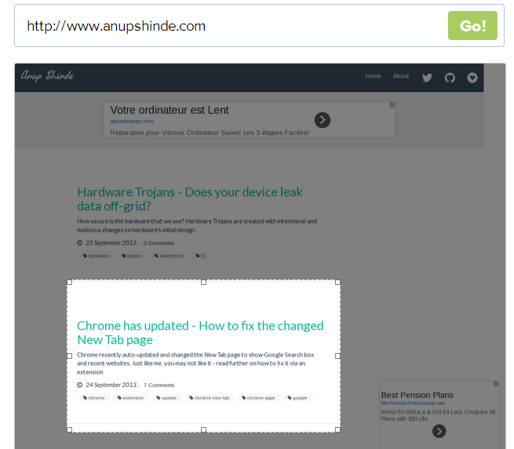
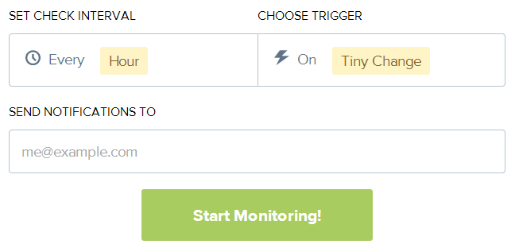

[VisualPing.io](http://visualping.io/) sends you an email alert for the webpage changes, for the webpages you set for monitoring.

---

## Set the URL and the area/section that you wish to monitor

---

##Set the Interval and place your email address for monitoring

---

That's it. As soon as the URL changes, you will get an email alert with both  before and after screenshots.

